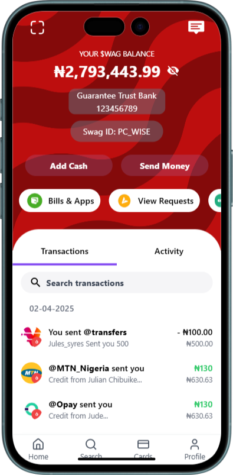
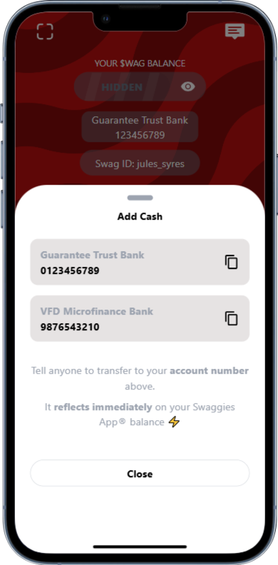
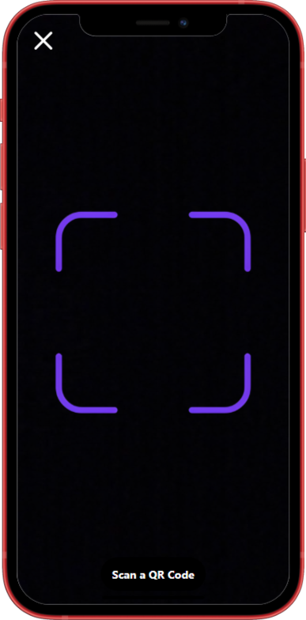

---

# PocketApp - Piggyvest Clone

<p align="center">
  
  
  
  
  
</p>

---

**PocketApp** by PiggyVest is a versatile mobile money and social commerce platform designed for Nigerians who want smarter ways to manage personal finances, run businesses, and handle group expenses. Fully licensed by the Central Bank of Nigeria (CBN) and backed by the Nigeria Deposit Insurance Corporation (NDIC), PocketApp provides a secure and reliable environment for all financial activities.  

My clone of PocketApp is built using **Angular**, **TailwindCSS**, and **CapacitorJS** to ensure a seamless, responsive experience across both web and mobile platforms.

This project showcases a modern fintech-style savings and investment app UI with responsive design, mobile capabilities, and a clean, professional layout.

---

## 🛠️ Built With

- **Angular** – Robust SPA Framework
- **TailwindCSS** – Utility-first CSS Framework
- **CapacitorJS** – Native app functionality for Web, iOS, and Android
- **TypeScript** – Strongly-typed JavaScript

---

## 🖼️ App UI Preview

<p align="center">
  
  
</p>  
<p align="center">
  
  
</p>

---

## 📦 Getting Started

### Prerequisites

- Node.js (v16+ recommended)
- Angular CLI
- Capacitor CLI
- Ionic CLI (optional for better mobile development tools)

```bash
npm install -g @angular/cli @capacitor/cli
```

### Installation

1. **Clone the repo**

```bash
git clone https://github.com/WackyDawg/Pocketapp-Clone.git
cd Pocketapp-Clone
```

2. **Install dependencies**

```bash
npm install
```

3. **Run the development server**

```bash
ng serve
```

4. **Build for production**

```bash
ng build 
```

5. **Add Capacitor**

```bash
npx cap init
npx cap add android
npx cap add ios
```

6. **Run on Device**

```bash
npx cap open android
npx cap open ios
```

---

## ✨ Features

- Clean and intuitive Piggyvest-style UI
- Responsive layouts using TailwindCSS
- Offline support with Capacitor
- Easy deployment to mobile stores
- Modular and scalable Angular architecture

---

## 🤝 Contributing

Contributions, issues and feature requests are welcome!  
Feel free to check the [issues page](https://github.com/WackyDawg/Pocketapp-Clone/issues) if you want to contribute.

---

## 📄 License

Distributed under the MIT License. See `LICENSE` for more information.

---

## 📞 Contact

- GitHub: [WackyDawg](https://github.com/WackyDawg)
- Twitter: [@yourhandle](https://twitter.com/yourhandle)

---

<br/>

---